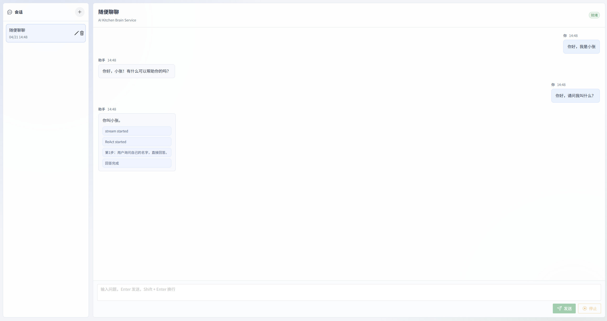
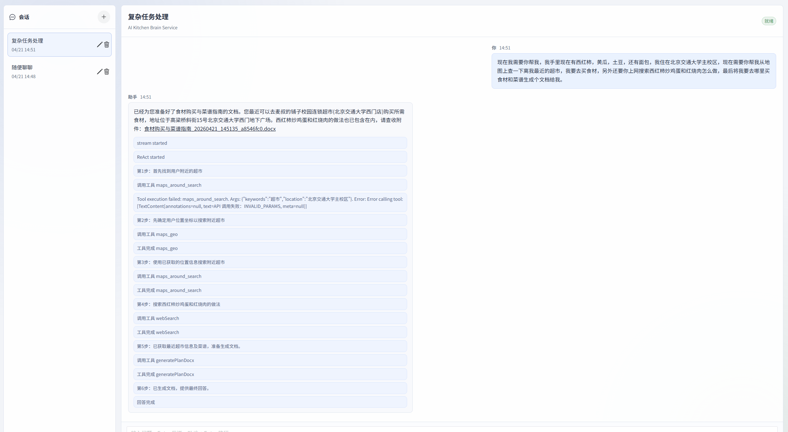

# AI Helper

AI Helper 是一个面向多场景智能助手的 Spring Boot 多模块项目，当前重点实现了基于 Spring AI 的 Kitchen Brain 智能体服务，并配套 Vue3 前端聊天工作台。项目支持多轮会话、ReAct 工具调用、地图/联网搜索/MCP 工具接入、RAG 检索增强、会话记忆持久化和文档生成。

## 1. 项目架构功能

```text
ai-helper
├── ai-common                  # 公共模块：统一响应、异常处理、日志切面、通用工具
├── ai-gateway                 # 网关模块：统一路由转发
├── ai-kitchen-brain-service   # 核心智能体服务：Spring AI、ReAct、RAG、记忆、工具调用
├── ai-utility-agent-service   # 工具型智能体服务：LangChain4j 相关能力预留/扩展
├── front-show                 # Vue3 前端聊天工作台
├── sql                        # 数据库脚本
├── generated-docx             # AI 生成的 docx 文档输出目录
└── 技术方案设计               # 架构方案、RAG 方案、前端生成提示词等设计文档
```

核心模块说明：

- `ai-gateway`：统一入口，默认端口 `8080`，将 `/super-host/**` 转发到 `ai-kitchen-brain-service`，将 `/code-assistant/**` 转发到 `ai-utility-agent-service`。
- `ai-kitchen-brain-service`：核心服务，默认端口 `8082`，提供 `/brain/sessions` 会话接口和 `/brain/chat/stream/{sessionId}/{message}` 流式聊天接口。
- `front-show`：前端工作台，基于 Vue3 + TypeScript + Vite，实现会话列表、历史消息、流式输出、ReAct 中间过程展示。
- `ai-common`：公共基础能力，包括 `CommonResp`、全局异常处理、Controller 日志切面等。

主要业务功能：

- 多会话管理：创建会话、查询会话、重命名会话、删除会话、查看历史消息。
- 流式聊天：基于 `SseEmitter` 输出模型回答和 ReAct 过程事件。
- ReAct 智能体：支持规划、工具调用、工具结果回灌、失败反馈重试、最终回答。
- 地图工具：通过 MCP 调用高德地图工具，支持地理编码、周边搜索、路线规划等。
- 联网搜索：通过 MCP/工具能力搜索实时网页信息。
- 文档生成：将购物计划、菜谱、方案内容导出为 docx 文件。
- 记忆持久化：会话历史写入 MySQL，短期窗口与摘要缓存写入 Redis。
- RAG 检索增强：支持查询重写、混合检索、重排和检索增强生成。

## 2. 亮点功能技术栈

后端技术栈：

- Java 17
- Spring Boot 3
- Spring AI
- Spring Cloud Gateway
- MyBatis
- MySQL
- Redis
- RocketMQ
- PostgreSQL / PgVector
- MCP Tool Calling
- Apache POI / docx 生成


亮点实现：

- 高性能会话记忆：通过 `MemoryLoadAdvisor` 和 `MemoryPersistAdvisor` 在模型调用前后自动装载、持久化上下文。Redis 优先承载短期窗口和滚动摘要，MySQL 作为历史消息与摘要游标的持久化回源，兼顾低延迟访问和长会话可恢复。
- Redis 窗口与异步摘要：短期记忆使用 Redis List 存储最近 N 轮对话，追加后通过 `trim` 固定窗口大小，并设置 TTL 控制缓存生命周期。窗口即将淘汰的历史会触发 RocketMQ 摘要任务，由模型生成 rolling summary 后回写 MySQL 与 Redis，避免长对话上下文无限膨胀。
- RAG 查询改写：`MyQueryTransformer` 基于历史上下文和独立提示词对用户问题进行重写，把多轮对话中的省略指代补全后再进入检索链路，提升知识库召回命中率。
- RAG 混合召回：`MyDocumentRetriever` 使用 `CompletableFuture` 并行执行关键词召回和向量召回。关键词召回基于 PostgreSQL 全文检索与 jieba 分词配置，向量召回基于 Qwen Embedding 与 pgvector 相似度搜索，两条链路互补提升稳定性。
- RAG 融合重排：`MyDocumentJoiner` 对多路候选结果做 RRF 融合与去重，再调用 DashScope/Qwen rerank 模型进行语义重排，最终按 `0.35 * RRF + 0.65 * rerank` 生成 TopK 上下文，降低单一路径召回偏差。
- ReAct 模式智能体：Planner 严格输出 `ReactPlan` JSON，动作只允许 `ANSWER` 或 `TOOL_CALL`。Agent 主循环负责单步规划、工具调用、observation 回灌和最终回答，能够完成地图检索、联网搜索、文档生成等多工具组合任务。


## 3. 本地效果图

会话记忆




复杂任务处理

